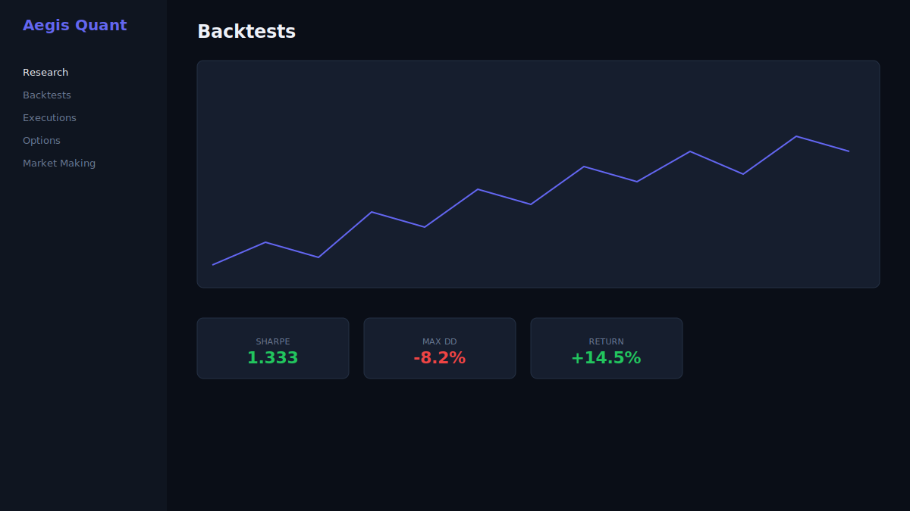

<p align="center">
  
</p>

<h1 align="center">Aegis</h1>

<p align="center">
  <strong>Institutional Quantitative Trading Platform</strong><br/>
  Exchange · Research · Execution · Options · Market Making · Risk Analytics
</p>

<p align="center">
  <a href="https://github.com/Ayushkumarsingh09/Aegis">GitHub</a> ·
  <a href="https://aegis-platform-phi.vercel.app">Live Portal</a> ·
  <a href="#quick-start">Quick Start</a> ·
  <a href="docs/getting-started.md">Docs</a> ·
  <a href="demo.md">Demo</a> ·
  <a href="CHANGELOG.md">Changelog</a> ·
  <a href="LICENSE">MIT License</a>
</p>

<p align="center">
  
  
  
  
  
</p>

---

## Overview

**Aegis** is a production-grade quantitative trading platform that unifies an ultra-low latency exchange, research infrastructure, execution algorithms, options analytics, market making, and risk management — all in one repository.

Everything is integrated. One portal. One design language. One deployment.

```
Exchange → Market Data → Quant Research → Execution → Options → Market Making → Risk → Dashboard
```

## Platform Modules

| Module | Description | Tech |
|--------|-------------|------|
| [**Exchange**](exchange/) | Matching engine, order book, risk, market data | C++20 |
| [**Quant Research**](quant/) | Features, backtesting, ML, portfolio optimization | Python |
| [**Execution**](execution/) | TWAP, VWAP, POV, iceberg, TCA, smart routing | Python |
| [**Options**](options/) | Black-Scholes, Greeks, vol surface, exotics | Python |
| [**Market Making**](market-maker/) | Avellaneda-Stoikov, inventory management | Python |
| [**Analytics**](analytics/) | VaR, CVaR, attribution, stress testing | Python |
| [**Portal**](portal/) | Unified homepage and module navigation | React |

## Screenshots

<table>
<tr>
<td width="50%"><br/><sub>Unified Platform Portal</sub></td>
<td width="50%"><br/><sub>Research Dashboard</sub></td>
</tr>
<tr>
<td colspan="2"><br/><sub>Exchange Order Book & Depth</sub></td>
</tr>
</table>

## Quick Start

### Demo (Recommended)

```powershell
# Windows
.\demo.ps1

# Linux / macOS
./demo.sh
```

### Docker (Full Stack)

```bash
docker compose up --build
```

### Services

| Service | URL | Description |
|---------|-----|-------------|
| **Portal** | http://localhost:3000 | Unified homepage |
| **Exchange Dashboard** | http://localhost:4000 | Live order book & trading |
| **Quant Dashboard** | http://localhost:4100 | Research & backtesting |
| **Exchange API** | http://localhost:9080 | Matching engine REST |
| **Quant API** | http://localhost:8090 | Research & platform API |
| **API Docs** | http://localhost:8090/docs | OpenAPI (Swagger) |
| **Prometheus** | http://localhost:9190 | Metrics |
| **Grafana** | http://localhost:4001 | Dashboards (admin/aegis) |

## Architecture

```
┌─────────────┐     ┌──────────────┐     ┌─────────────────┐
│   Portal    │────▶│  Quant API   │────▶│ Matching Engine │
│  Homepage   │     │  Research    │◀────│  + Order Book   │
└─────────────┘     └──────┬───────┘     └────────┬────────┘
                           │                       │
                    ┌──────▼───────┐        ┌──────▼────────┐
                    │  Execution   │        │  Market Data   │
                    │  Options/MM  │        │  Publisher     │
                    └──────────────┘        └────────────────┘
```

See [Platform Architecture](docs/platform-architecture.md) for full details.

## Features

### Exchange (C++20)
- Price-time priority matching · Limit, Market, IOC, FOK, Post-Only, Stop, Stop-Limit
- Pre-trade risk engine with kill switch
- Market data publisher, recorder, replay
- REST API + SSE streaming · Prometheus metrics

### Quant Research
- 30+ features (VWAP, RSI, MACD, microprice, PCA, cointegration)
- Event-driven backtester with latency & slippage simulation
- ML pipeline (XGBoost, LightGBM, CatBoost) with MLflow tracking
- Portfolio optimization (Markowitz, Black-Litterman, HRP, Kelly)

### Execution Engine
- TWAP · VWAP · POV · Iceberg · Arrival Price
- Square-root market impact model · Smart order routing · TCA

### Options Analytics
- Black-Scholes · Binomial American · Monte Carlo
- Full Greeks · IV solver · Volatility surface · Barrier & Asian options

### Market Making
- Avellaneda-Stoikov optimal quoting
- Inventory-aware spread management · Fill probability · Exchange simulation

## Development

```bash
# Install all Python packages
python scripts/install-platform.py

# Run all tests (45 passing)
pytest execution/tests options/tests market-maker/tests analytics/tests aegis-quant/tests -v

# Build exchange (C++)
cmake -B build -DCMAKE_BUILD_TYPE=Release -DAEGIS_BUILD_TESTS=ON
cmake --build build -j && cd build && ctest --output-on-failure
```

## Documentation

| Document | Description |
|----------|-------------|
| [Getting Started](docs/getting-started.md) | Installation and setup |
| [Platform Architecture](docs/platform-architecture.md) | System design |
| [Developer Guide](docs/developer-guide.md) | Development workflow |
| [Deployment](docs/deployment.md) | Production deployment |
| [Benchmarks](docs/benchmarks.md) | Performance benchmarks |
| [Research Guide](aegis-quant/docs/research-guide.md) | Quant research workflows |
| [Demo Guide](demo.md) | Automated demonstrations |

## Repository Structure

```
Aegis/
├── exchange/          → C++ modules (core/, matching-engine/, etc.)
├── quant/             → aegis-quant/ research platform
├── execution/         → Execution algorithms
├── options/           → Options analytics
├── market-maker/      → Market making engine
├── analytics/         → Risk analytics
├── portal/            → Unified homepage
├── dashboard/         → Exchange trading UI
├── sdk/               → Python SDKs
├── docs/              → Documentation & screenshots
├── docker/            → Container configs
├── benchmark/         → C++ benchmarks
└── tests/             → C++ tests
```

## Contributing

See [CONTRIBUTING.md](CONTRIBUTING.md). We use [Conventional Commits](https://www.conventionalcommits.org/).

## License

MIT License — see [LICENSE](LICENSE).

## Roadmap

- [ ] WebSocket streaming for quant API
- [ ] Live Polygon/Binance data connectors
- [ ] Kubernetes deployment manifests
- [ ] FIX protocol gateway

---

<p align="center">Built for institutional-grade quantitative trading research and execution.</p>
