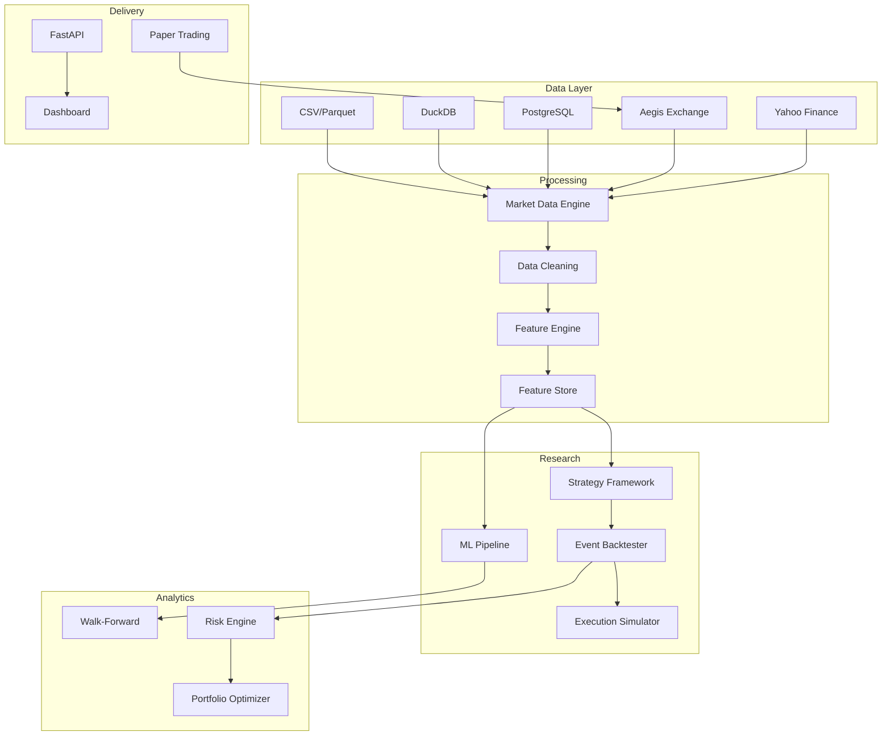

# Aegis Quant Architecture

## System Overview

## Design Decisions

1. **Polars + DuckDB** for columnar analytics — faster than pure Pandas for large datasets
2. **Event-driven backtester** — institutional fidelity with order queue, latency, slippage
3. **Plugin strategies** — `Strategy` base class with registry pattern
4. **MLflow** — experiment tracking and model registry
5. **FastAPI** — async-ready REST with OpenAPI auto-generation
6. **Aegis Exchange integration** — first-class connector for live data and paper trading

## Data Flow

1. Connectors ingest OHLCV bars into DuckDB + Parquet
2. Cleaning pipeline removes bad ticks, applies corporate actions
3. Feature engine computes 30+ signals per bar
4. Strategies consume features via `BacktestContext`
5. Execution simulator models realistic fills
6. Risk engine computes 15+ metrics on returns
7. Results exposed via API and dashboard
