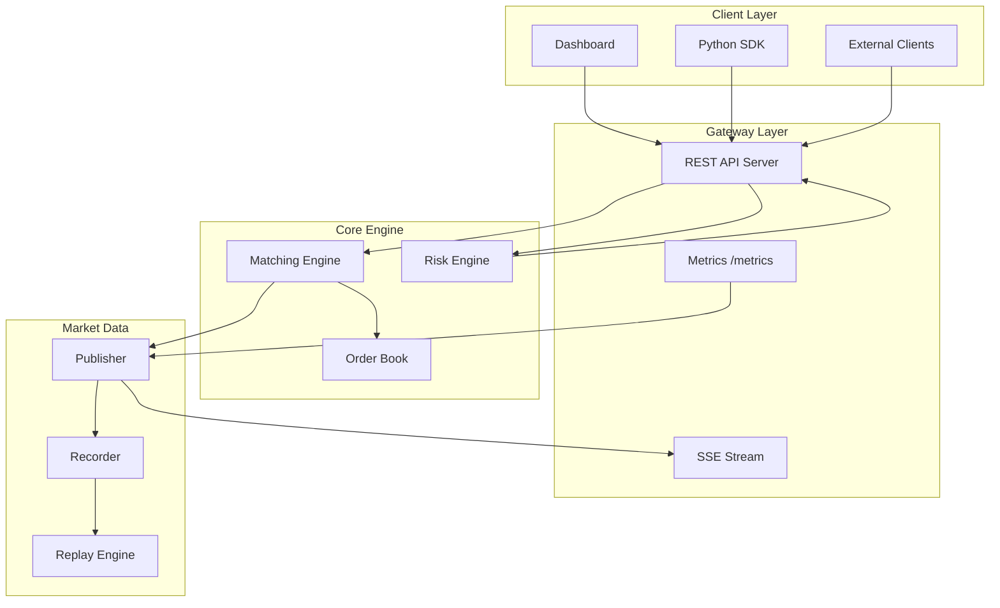
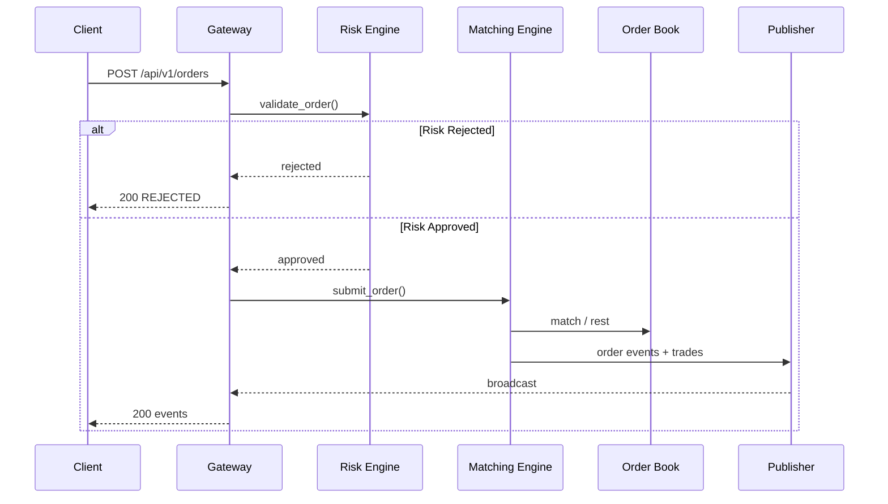

# Architecture

## Overview

Aegis Exchange is a modular electronic trading system designed for ultra-low latency order matching with production-grade risk controls and market data distribution.

## Component Diagram



## Order Flow Sequence



## Order Book Design

The order book uses a two-level structure:

1. **Price Level Map**: `std::map<Price, PriceLevel>` sorted by price (descending for bids, ascending for asks)
2. **FIFO Queue**: Intrusive doubly-linked list per price level for time priority

```
Bids (descending)          Asks (ascending)
┌──────────────┐           ┌──────────────┐
│ 100.05 → [O1→O2→O3]     │ 100.10 → [O4]│
│ 100.04 → [O5]           │ 100.11 → [O6→O7]│
│ 100.03 → [O8]           │ 100.12 → [O9]│
└──────────────┘           └──────────────┘
```

### Memory Management

Orders are stored in a fixed-capacity `ObjectPool<Order, 1'000'000>`:
- O(1) allocation via free-list
- No heap allocations in the matching hot path
- Stable memory addresses via pool indices

## Matching Algorithm

1. **Validate** order parameters (price, quantity, tick size)
2. **Risk check** via validation pipeline
3. **Post-Only check**: reject if order would cross spread
4. **FOK check**: reject if full quantity cannot be filled
5. **Match** against contra side at best price (price-time priority)
6. **Rest** remainder on book (Limit/GTC) or **cancel** (IOC/Market)
7. **Check stop orders** triggered by trade prices
8. **Publish** events to market data layer

## Threading Model

- Single-threaded matching per instrument (no locks in hot path)
- Mutex-protected risk engine and market data publisher
- API server handles concurrent HTTP requests via thread pool (httplib)

## Data Types

| Type | Representation | Notes |
|------|---------------|-------|
| Price | `int64_t` | Fixed-point, scale 10,000 |
| Quantity | `int64_t` | Whole units |
| OrderId | `uint64_t` | Monotonic counter |
| SequenceNum | `uint64_t` | Per-event ordering |
| Timestamp | `int64_t` | Nanoseconds |
